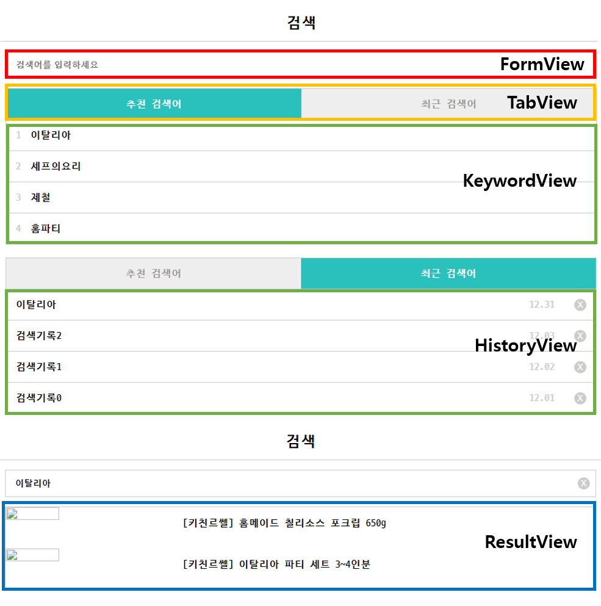

# vanillaJS-search-front
[인프런] 실습 UI 개발로 배워보는 순수 javascript 개발

## 목적
Javascript에 대한 이해도를 높이고 간단한 웹어플리케이션 제작하기

## 구조
```shell
.
├── index.html
├── js        
│   ├── app.js
│   ├── controllers
│   │   └── MainController.js
│   ├── models
│   │   ├── HistoryModel.js  
│   │   ├── KeywordModel.js  
│   │   └── SearchModel.js   
│   └── views
│       ├── FormView.js
│       └── View.js
└── style.css
```


## 기능
### FormView
+ 검색어 입력
+ `ENTER`키를 이용한 검색
+ `X`버튼 클릭시 입력된 내용 삭제
### TabView
+ [추천 검색어/최근 검색어] 탭의 활성화
### KeywordView
+ `KeywordModel`의 추천 검색어 데이터 렌더링
+ 추천 검색어 클릭시 검색하기
### HistoryView
+ `HistoryModel`의 검색 내역 데이터 렌더링
+ `x`버튼 클릭시 해당 검색 내역 삭제
+ 검색어 입력시 검색 내역 추가
+ 검색내역 클릭시 검색하기
### ResultView
+ `SearchModel`의 검색 결과 렌더링
## 배운 것
1. 모듈 구조 설계 방법.
2. 각 모듈마다 `tag`변수를 활용하여 디버깅을 용이하게 진행하는 방법
3. 간단한 웹 어플리케이션을 통해 MVC구조의 이해.
  + View의 역할은 렌더링 그 자체이다. (Controller가 처리해야 할 영역을 침범해서는 안된다.)
  + Controller의 역할은 View에서 변경된 내용을 전달받아 데이터를 알맞게 가공한 후 다시 View에게 전달하는 역할. (중앙 관리실)
 4. Vanilla JS를 이용한 웹 어플리케이션 설계, DOM 조작 및 ES6 문법 익히기
 
## 참고
[실습 UI 개발로 배워보는 순수 javascript 와 VueJS 개발](https://www.inflearn.com/course/%EC%88%9C%EC%88%98js-vuejs-%EA%B0%9C%EB%B0%9C-%EA%B0%95%EC%A2%8C)
